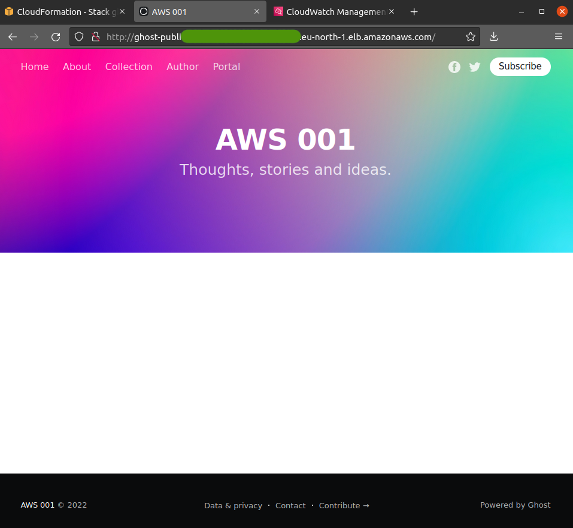

<!-- PROJECT LOGO -->
<br />
<div align="center">
  <a href="https://github.com/ramromail/aws001">
    
  </a>

  <h1 align="center">Project AWS cloud architect</h1>
  A demo/test of aws cloudformation skills
</div>

<!-- ABOUT THE PROJECT -->
## Introduction

This is demo project to test my aws cloudformation skills. 

In this demo I am going to deploy Ghost blog using docker container in aws fargate.


## Plans for the project
1. Able to adapt to traffic spikes
2. Handle increases of load
3. Resilient to geographical failure
4. Possbile to recover in case of a region failure
5. Deploy without any downtime
6. Multiple separated environments
7. Visualising and debugging environment
8. Security team visibility into the platform/operations
9. Serverless function to handle blog posts
10. Optimised for costs, easy to maintain/develop


## Plans on how to fulfill the requirements
1. Able to adapt to traffic spikes
    - use AWS cloudfront

2. Handle increases of load
    - use autoscaling for ECS, Fargate scaling

3. Resilient to geographical failure
    - use multi-AZ RDS and read replicas in a different region

4. Possbile to recover in case of a region failure
    - use cloudfront templates to deploy in a different region within few minutes

5. Deploy without any downtime
    - build images and push, FARGATE will take care of deployment

6. Multiple separated environments
    - use prefixes and conditions to deploy different environments

7. Visualising and debugging environment
    - use AWS cloutwatch monitoring

8. Security team visibility into the platform/operations
    - use AWS cloudtrails and cloudwatch

9. Serverless function to handle blog posts
    - use a lambda function

10. Optimised for costs, easy to maintain/develop
    - use cloudformation and Fargate spot

## Built With

Following major AWS product and services were used, along with other necessary components.
  
* ECS, Fargate
  - This was to achive requirement #1.

* MySQL RDS
  - This was used to store blog posts in a RDS databse system.

* AWS EFS
  - To store blog contents such as images.

* ECR, Docker image 
  - The official ghost blog image version 4-alpine was used as a base image

## Autoscaling
  Autoscaling has been enabled. To make it easy to test, I have created scaling policy such that scaling policy will come into action as soon as number of request is more than 2 per ALB. In real world we would use CPU usage or atleast a much high number than 2 requests. Please see the screenshots below to see the scaling policy in action.

## DB Passwords 
  Database passwords are stored in secrets manager.

## Trying it out
  You can download this repo on your computer and deploy it on aws using aws cli. To deploy please run the script `launch.sh`.

  There are two stages for deployment. 
  ### Step 1
  Substitue a suitable prefix for the stack name on line 8 in launch.sh.
  ```
  PREFIX=ghostblog
  ```
  A prefix 'ghostblog' has been supplied by default. Uncomment line 42
  ```
  ./stage_1.sh $PREFIX
  ```
  and execute the script.

  This script will run `stage_1.sh` script and thus create 3 stack on AWS cloudformation. 
  1. ECR stack for hosting container images.
        - This ECR repo will be used to hold container images tagged as `lateset` among others.
  2. VPC stack
      - We need network connectivity, loadbalancers, firewall, subnet etc. required to deploy our service.
  3. RDS stack
      - This stack deploys a MySQL database.

  ### Step 2
  At this point we have a ECR repository, update `pushimg.sh` script with necessary data. Information about required data is provided in the script itself as comments. Uncomment line 50 in `launch.sh` and then execute it.
  ```
  ./pushimg.sh $PREFIX
  ```

  It willl create a ghost blog image and deploy it to ECR. This image will be used to launch an ECS service task definition.


  ### Step 3
  Now that we have a stack and an image, we can execute the final stage.
  Uncomment line 60 in `launch.sh`
  ```
  ./stage_2.sh $PREFIX
  ```

  This will launch an image in ECS, using FARGATE. For `development` or `production` environments lines 10-12 can be updated to control number of containers deployed and ammount of resources allocated to each container.

  Before the next step if you have not already, add the following to your aws cli configuration file at `~/.aws/config`
  ```
  cli_binary_format=raw-in-base64-out
  ```

  ### Step 4
  At this point we are ready to deploy our lambda function. Let's do it by uncommening the line 64 in file `launch.sh` and then executing it on terminal.
  ```
  ./stage_3.sh $PREFIX
  ```

  This will package or NodeJs function and upload it to S3 bucket. After that create a transformed version of `lambda-raw.yaml` with name `lambda-ready.yaml` in the infra folder. 
  
  And then `lambda-ready.yaml` will be used to deploy the lambda function.


  ### Executing Lambda function

  Lambda function can be executed either by executing directly the `delete-posts-lambda.sh` shell script by passing the Lambda stack name as the first parameter. Another option is to comment out all the uncommented line in previous stages then uncommenting the line 68 and executing the script.
  ```
  ./delete-posts-lambda.sh $DATABASE_NAME
  ```

  :warning: Executing the `delete-posts-lambda.sh` script with correct lambda stack name will delete all posts.

## Screenshots
  *Starting to deploy the stack*
  
  <br />
  
  *Stacks being created*
  
  <br />
  
  *First set of stack ready*
  
  <br />
  
  *Time to create and push docker image of out Ghost Blog*
  
  <br />

  *Image pushed to ECR tagged latest*
  
  <br />
  
  *Deploying the final stack, containg service, task definition and scaling policies*
  
  <br />
  
  *Cloudwatch log groups for logs from containers*
  
  <br />
  
  *Finally blog up and running*
  
  <br />

  *Cloudwatch in alarm mode due to more than 2 requests on ALB as set in scaling policy for demo*
  

  *ECS starting up new container*
  
  <br />

  *Both containers running*
  
  <br />

  *Scaling down when no loger in alarm state*
  
  <br />
    
  *Lambda function executed, logs in cloudwatch*
  
  <br />
    
  *Ghost blog with all posts deleted*
  
  <br />

